## Test the application.

Now that you have successfully deployed the Extension application to SAP BTP and uploaded the application manifest  Microsoft Teams Admin Center in the previous steps let us go ahead and test the application.

### Installation Steps

1. Log in to SAP BTP Cockpit and check your teams extension application that you have deployed to SAP BTP in the previous step5 tutorial. It should be in started state.

2. Log in to Microsoft Teams as SCM Operations manager (a user who interacts with the supplier for Purchase Order fulfilment ).

3. Install the custom app by following the below steps.
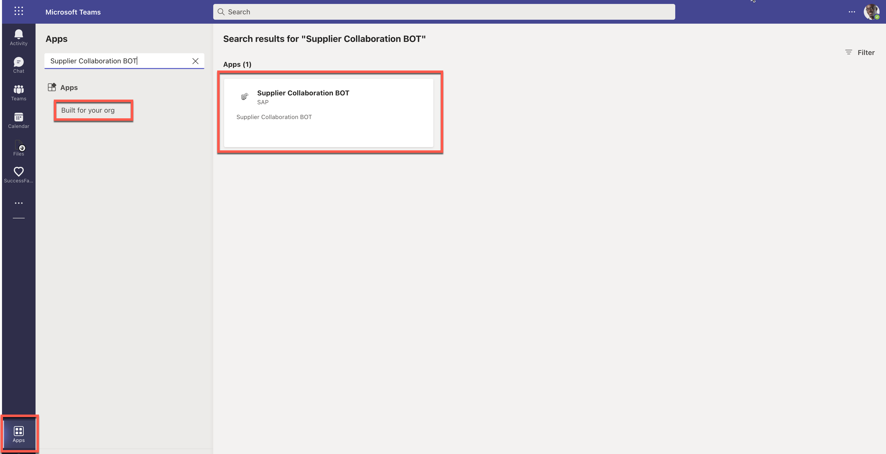

4. Select the application and add the application.
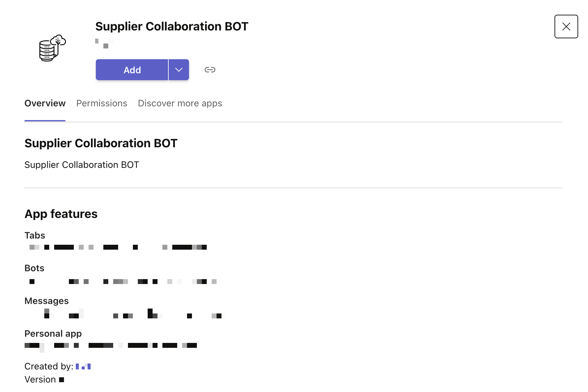

5. Once the app has been added, you should be able to see the below in your MS Teams with the below Welcome message.
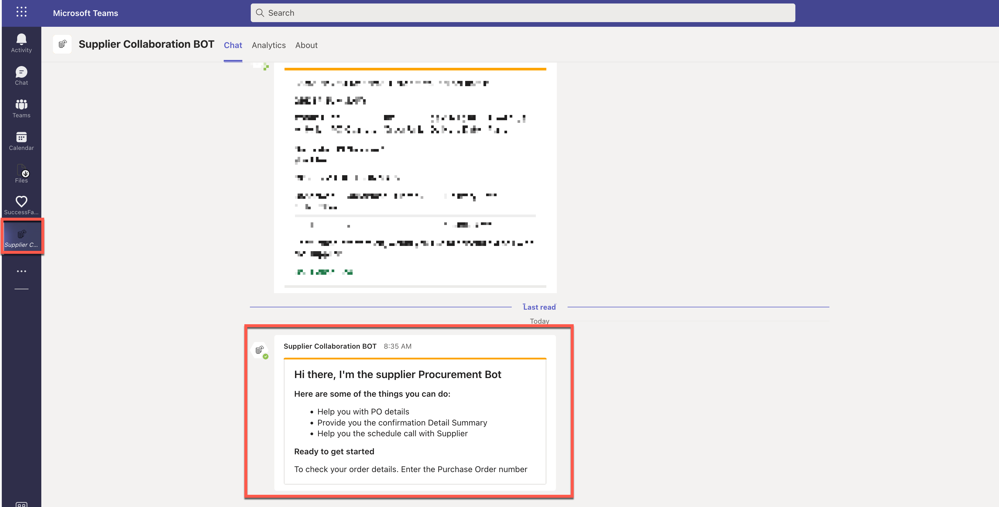

The Supplier Collaboration BOT supports 2 s cenarios.

### Scenario1 - Pending Supplier Confirmations

1. You will receive the notification for Pending Supplier Confirmations everyday at the scehduled time or if you want to notifications of Purchase Orders with pending supplier confirmations you can login to SAP S/4HANA system and run the "ZPEND_SUPPL_CONF_EMSEND_JOB" using the SE38 transaction.
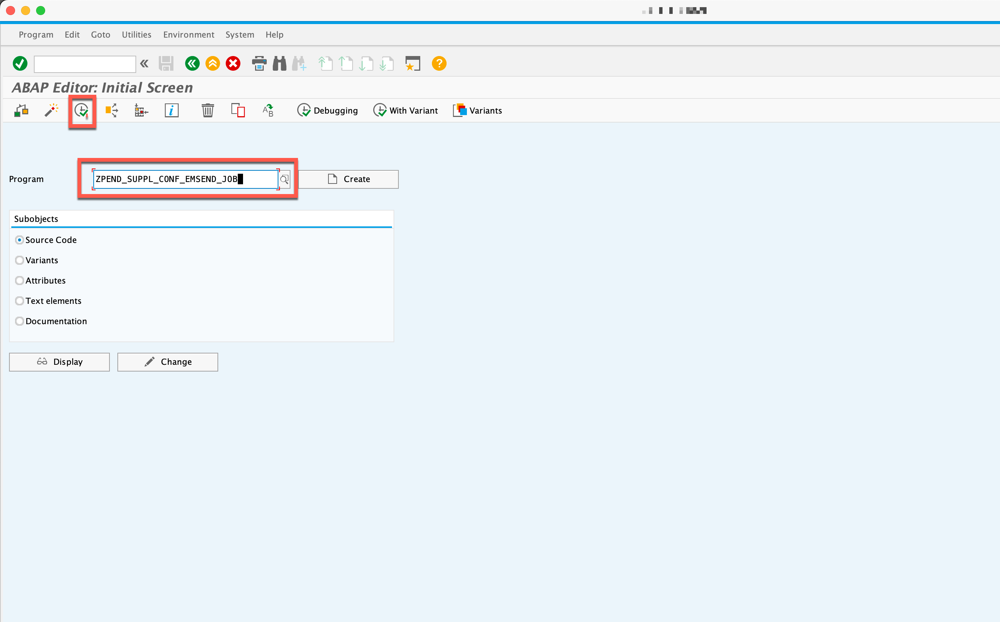

2. Once you receive the notification of Purchase Orders with pending supplier confirmations, click on the corresponding "Select" button of the respective purchase order to view the details.

3. Click the "Yes" button in the purchase order details notification to start the scehduling of meeting.
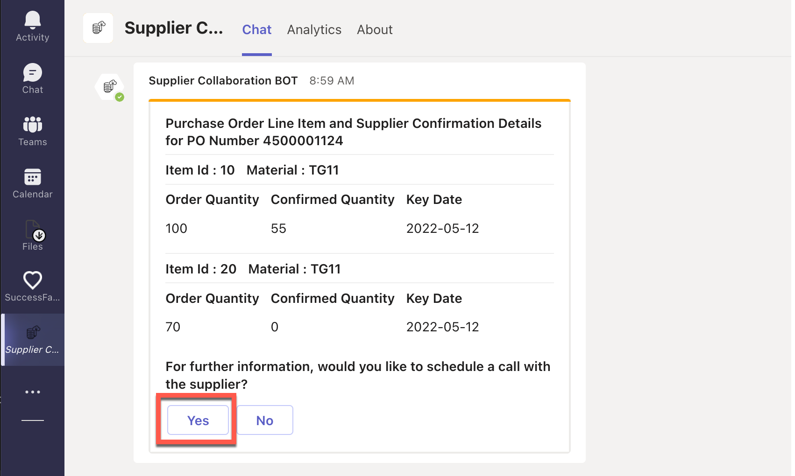

4. Click the "Schedule" button in the Meeting popup to schedule the meeting with the Supplier.
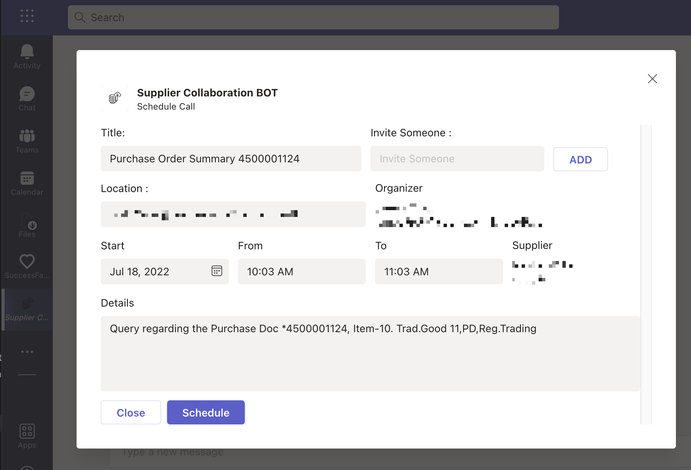

5. The application displays the popup once the meeting is scheduled successfully.
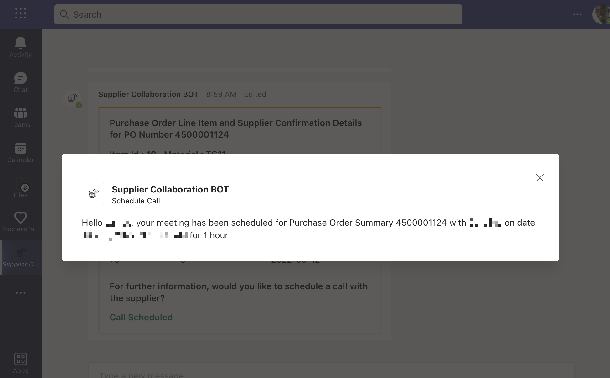

6. Join the meeting with the Supplier using Microsoft Teams

7. Open the in-meeting application to view the PO Details.
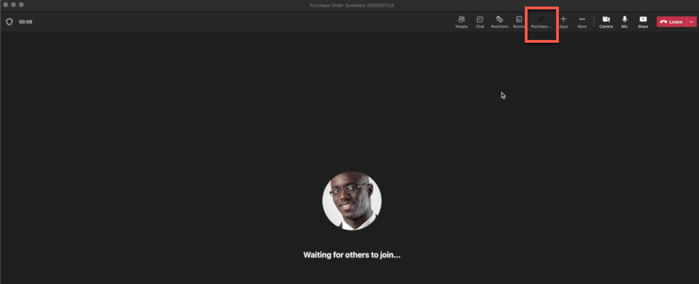

8. Query the Purchase Order Item details by clicking the "Search Order" button in the in meeting application.
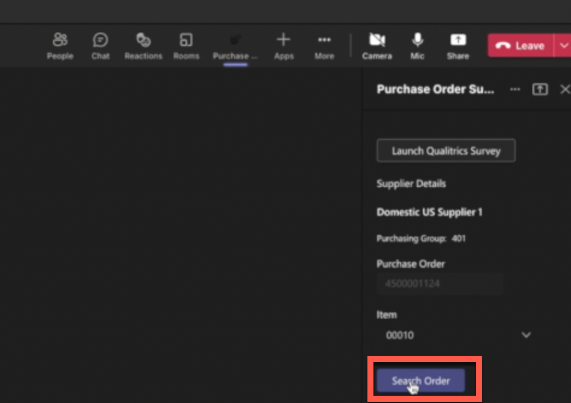

9. Edit the Supplier Confirmation details by click the "Edit button" of the respective supplier confirmation.
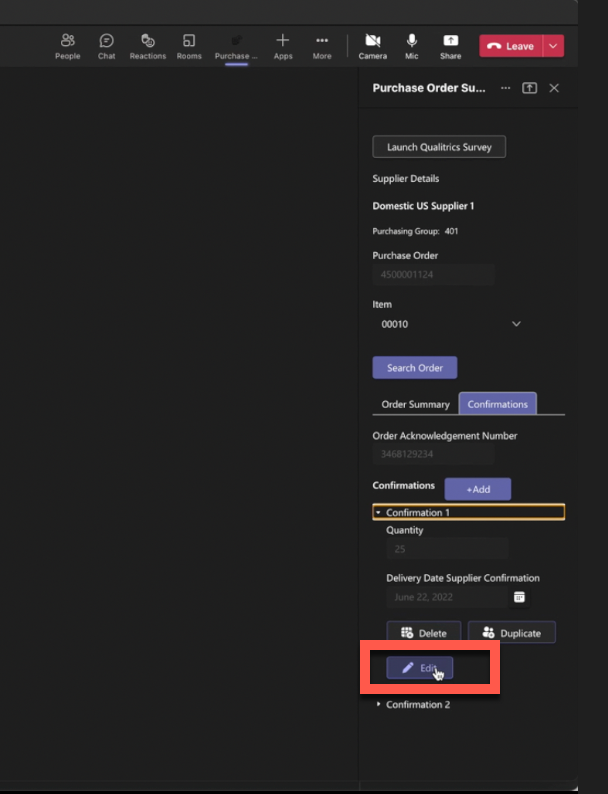

10.Update the details like quantity and delivery date of the supplier confirmation to SAP S/4HANA system from the in-meeting application by click the save button.
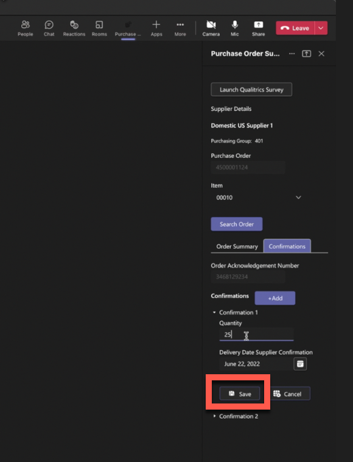

11. You can also create new supplier confirmations and delete the existing supplier confirmations using the in-meeting aplication.

Congrations - You have updated the supplier confirmations to SAP S/4HANA system successfully.

### Scenario2 - Query Un-fulfilled Purchase Orders

1. Query the Purchase Order details by entering the PO number in the Supplier Collaboration BOT.
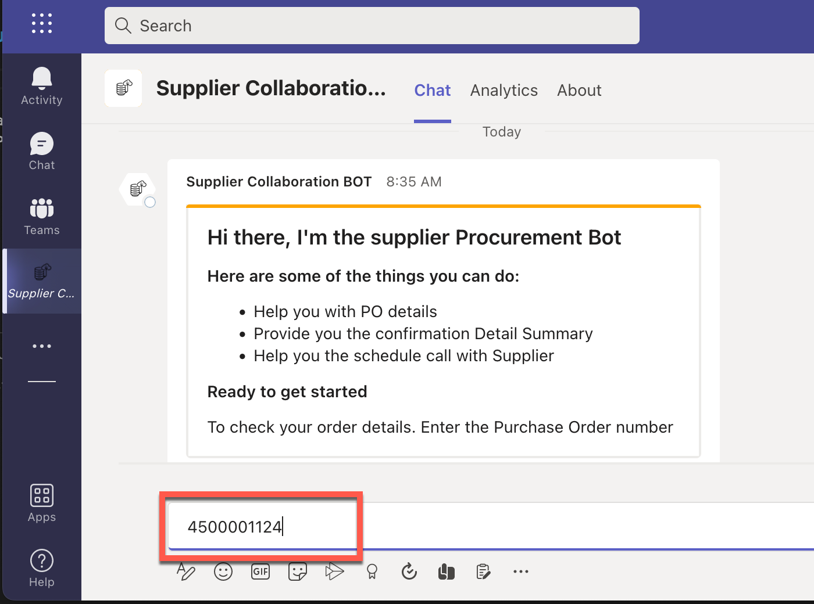

2. Select the Purchase Order Item by clicking the respective "Select" button to view the details.
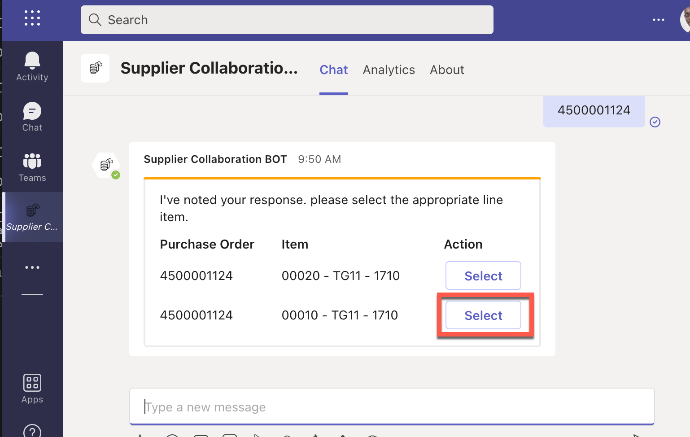

3. The BOT displays the selected PO Item details.
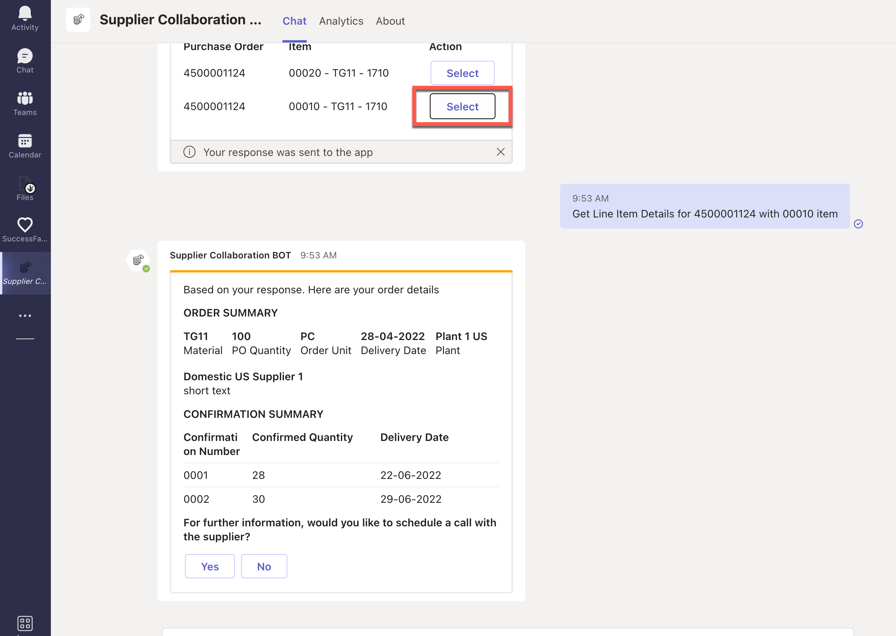

4. Schedule the meeting with the supplier by clicking the "Yes" button in the above PO details message.
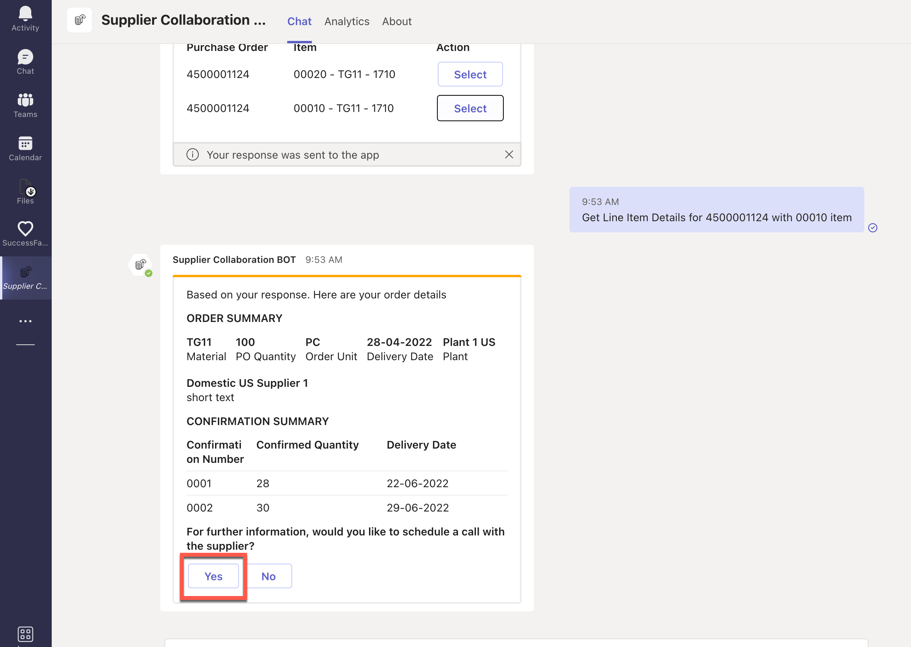

5. Collaborate with the supplier by following the above scenario 1 steps from step 5 to step 11.

Congratulations! You have completed the end-to-end Supplier Collboration scenario with Microsoft Teams and SAP S/4HANA.